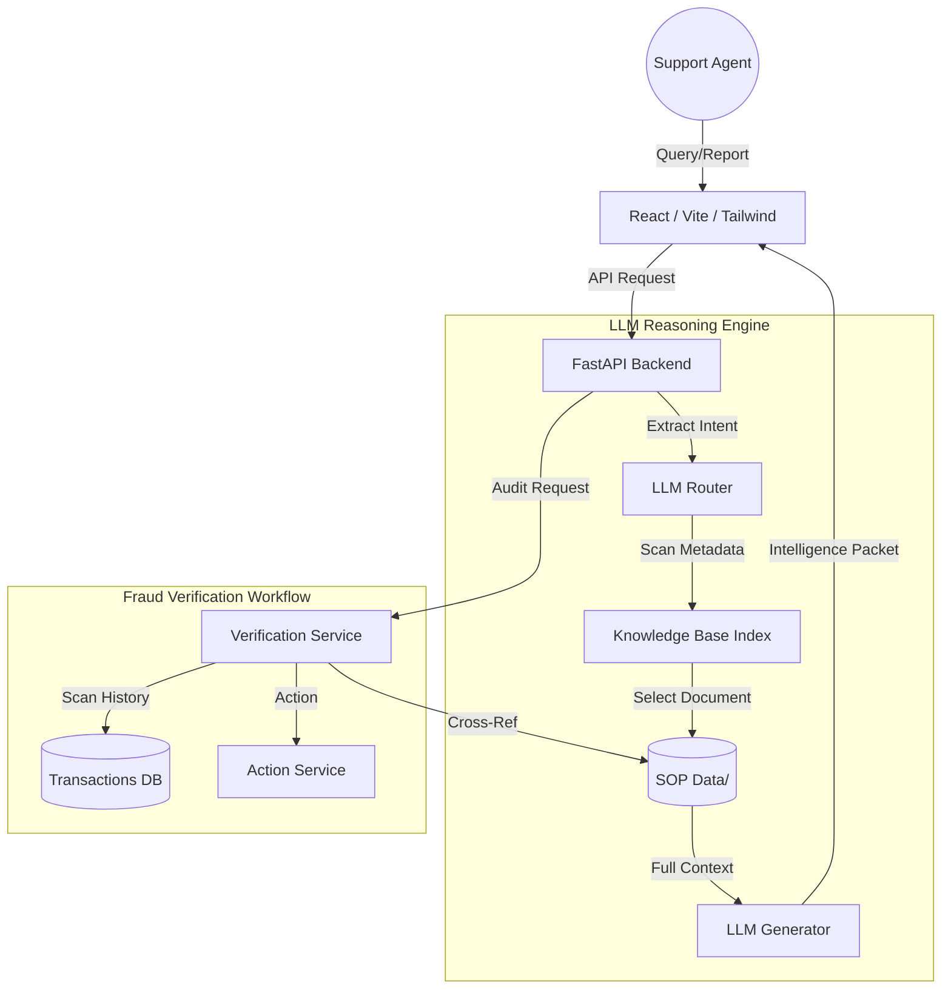

# FraudSight AI – Intelligent Fraud Intelligence Automation

**FraudSight AI** is a state-of-the-art, **Reasoning-based Vectorless Architecture** designed to empower fraud investigation teams with instant, context-aware access to Standard Operating Procedures (SOPs) and real-time transaction intelligence.

Unlike traditional RAG systems that rely on complex vector embeddings, FraudSight AI utilizes an **LLM-driven Reasoning Engine** to dynamically route queries to the most relevant internal protocols, ensuring high precision and full explainability.

---

##  Key Features

###  Neural Intelligence Hub (Reasoning Retriever)
- **Vectorless Retrieval**: Avoids the "black box" of embeddings by using the LLM to reason about document relevance based on semantic intent and SOP metadata.
- **Dynamic Context Injection**: Automatically selects and injects the full relevant SOP into the LLM's context window for grounded response generation.
- **Explainable Routing**: Every retrieval decision is rooted in a logical match between the query and the SOP's defined scope.

###  Autonomous Fraud Verification
- **Cross-Layer Audit**: Automatically correlates suspicious reports with real-time transaction logs in `transactions.json`.
- **Pattern Matching**: Identifies complex fraud typologies including:
    - **Synthetic Identity Fraud (SIF)**
    - **Account Takeover (ATO)**
    - **Authorized Push Payment (APP) Scams**
    - **Card-Not-Present (CNP) Fraud**
- **Automated Response**: Triggers immediate defensive actions (Session Revocation, MFA Reset, Account Freeze) based on verified findings.

### 📈 Active Feedback Loop
- **Continuous Learning**: Support agents can rate intelligence packets, providing a structured dataset for future engine fine-tuning.
- **Audit Logging**: Every verification and retrieval action is logged for compliance and post-mortem analysis.

---

##  System Architecture



---

##  Tech Stack

- **Frontend**: React 18, Vite, Tailwind CSS, Lucide React (Cyber-Security Theme).
- **Backend**: FastAPI, LangChain (for LLM orchestration).
- **Storage**: Vectorless (Direct File System) + SQLite (for feedback/audit logs).
- **LLM Support**: 
    - **Ollama**: Local execution (Llama 3).
    - **HuggingFace**: Inference API support.
    - **Mock Mode**: For offline development and testing.

---

##  Setup & Installation

### Prerequisites
- Python 3.9+
- Node.js 18+
- (Optional) [Ollama](https://ollama.ai/) for local LLM execution.

### Backend Setup
1. Navigate to the `backend` directory.
2. Install dependencies:
   ```bash
   pip install -r requirements.txt
   ```
3. Configure your environment in `app/config.py` or a `.env` file (e.g., `LLM_MODE=Mock`).
4. Run the server:
   ```bash
   python -m uvicorn app.main:app --reload
   ```

### Frontend Setup
1. Navigate to the `frontend` directory.
2. Install dependencies:
   ```bash
   npm install
   ```
3. Start the dev server:
   ```bash
   npm run dev
   ```

---

## Usage Guide

1. **Ingest Data**: While the system is vectorless, you can validate the knowledge base by running:
   ```bash
   python scripts/run_ingestion.py
   ```
2. **Launch Dashboard**: Open your browser to the local Vite port.
3. **Simulate Fraud**: Use the **Command Center** to select a live threat or the **Intelligence Hub** to query specific protocols.
4. **Run Simulations**: Test the end-to-end flow with:
   ```bash
   python scripts/simulate_fraud.py
   ```

---

## Knowledge Base Structure

The system is pre-populated with high-fidelity fraud SOPs in `backend/data/`:
- `TECH_SYNTH_012.md`: Synthetic Identity Fraud protocols.
- `SO_ATO_001.md`: Account Takeover mitigation steps.
- `APP_SCAM_008.md`: Authorized Push Payment scam workflows.
- `CNP_FRAUD_005.md`: Card-Not-Present detection strategies.

---


